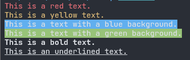

# mruby-terminal-color
A lightweight and flexible library for adding color and style to terminal output in mruby applications.

## Usage

Add conf.gem line to `build_config.rb`:

```ruby
MRuby::Build.new do |conf|
-- snip --
  conf.gem github: 'buty4649/mruby-terminal-color'
end
```

## Basic Example

Here is a basic example demonstrating how to apply colors and styles to terminal output:



```ruby
puts "This is a red text.".red
puts "This is a yellow text.".color("yellow")
puts "This is a text with a blue background.".bg_blue
puts "This is a text with a green background.".color(nil, :green)
puts "This is a bold text.".bold
puts "This is an underlined text.".underline
```

### Available Colors

- `black`
- `red`
- `green`
- `yellow`
- `blue`
- `magenta`
- `cyan`
- `white`
- `gray`
- `bright_black`
- `bright_red`
- `bright_green`
- `bright_yellow`
- `bright_blue`
- `bright_magenta`
- `bright_cyan`
- `bright_white`
- `default`

### Available Styles

- `bold`
- `underline`
- `blink`
- `reverse`
- `invisible`
- `reset`

### 8-bit Color

You can specify 8-bit colors using a number between 0 and 255:

```ruby
puts "This is a text with 8-bit color.".color(42)
```

### 24-bit Color

You can specify 24-bit colors using a hexadecimal color code in the format `#RRGGBB`:

```ruby
puts "This is a text with 24-bit color.".color('#FF5733')
```

### Combining Colors and Styles

You can combine multiple styles with colors:

```ruby
puts "This is a bold and red text.".red.bold
puts "This is a text with bold and 8-bit color.".color(42).bold
puts "This is a text with underline and 24-bit color.".color('#FF5733').underline
```

### C Function

For C language integration, you can use the following function:

```c
mrb_value mrb_str_set_color(mrb_state *mrb, mrb_value str, mrb_value color, mrb_value bg_color, mrb_value mode);
```

## License

The gem is available as open source under the terms of the [MIT License](./LICENSE).
